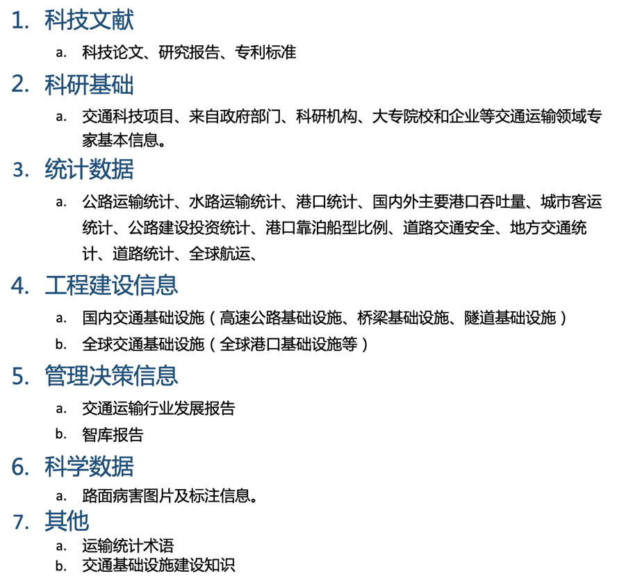
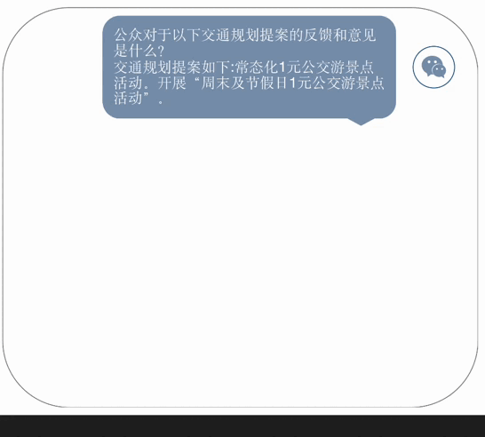

<p align="center" width="100%">
<a target="_blank"></a>
</p>


# TransGPT · 致远
<!-- **TransGPT** -->

<p align="center">
🤗 <a href="https://huggingface.co/DUOMO-Lab/TransGPT-v0" target="_blank">TransGPT-7B</a> 
  •
🤖 <a href="https://huggingface.co/DUOMO-Lab/TransGPT-v0" target="_blank">DUOMO</a> 
  • 
💬 <a href="https://github.com/DUOMO/trans_wechat.jpg" target="_blank">WeChat</a>
</p>

<div style='display:flex; gap: 0.25rem; '>

<a href='https://huggingface.co/DUOMO-Lab/TransGPT-v0'></a>
<a href='https://huggingface.co/DUOMO-Lab/TransGPT-v0'></a> 
<a href='https://huggingface.co/DUOMO-Lab/TransGPT-v0'></a> 
</div>

<h4 align="left">
    <p>
        <b>中文</b> |
        <a href="https://github.com/cocacola-lab/TransGPT.git/README-English.md">English</a>
    </p>
</h4>

## 摘要
TransGPT是国内首款开源交通大模型，主要致力于在真实交通行业中发挥实际价值。它能够实现交通情况预测、智能咨询助手、公共交通服务、交通规划设计、交通安全教育、协助管理、交通事故报告和分析、自动驾驶辅助系统等功能。TransGPT作为一个通用常识交通大模型，可以为道路工程、桥梁工程、隧道工程、公路运输、水路运输、城市公共交通运输、交通运输经济、交通运输安全等行业提供通识常识。以此为基础，可以落脚到特定的交通应用场景中。
- 模型：TransGPT-7B，
- 代码：基本训练和推理代码，
- 数据：
  - ～34.6万条文本数据（用于领域内预训练）
  - ～5.8万条对话数据（用于微调）
- **开源免费可商用**：不仅对学术研究完全开放，仅需邮件申请并获得官方商用许可后，即可以免费商用。


## 最新发布
- [07.18] ✨ 开源 [**TransGPT**](https://huggingface.co/DUOMO-Lab/TransGPT-v0).
- [07.17] ✨ 开源 [**TransGPT-DATA-sft**](https://huggingface.co/datasets/DUOMO-Lab/TransGPT-sft) (💼**可商用**)
- [07.17] ✨ 开源 [**TransGPT-DATA-pt**](https://huggingface.co/datasets/DUOMO-Lab/TransGPT-pt) (💼**可商用**)


## 目录
- [开源数据集](#开源数据集)
- [示例输出](#TransGPT示例输出)
- [测评](#测评)
- [模型下载](#模型下载)
- [环境部署](#环境部署)
- [训练和推理](#训练和推理)
- [其他](#声明)

## 开源数据集

### 交通领域数据集
- 领域数据源包含两个部分：

| 内容       | 下载地址                            | 备注     |
|:---------|---------------------------------|--------|
| 领域预训练数据集 | [pretrain_data](https://huggingface.co/datasets/DUOMO-Lab/TransGPT-pt) | 非对话数据集 |
| 领域微调数据集  | [finetune_data](https://huggingface.co/datasets/DUOMO-Lab/TransGPT-sft) | 对话式数据集 |

- 数据来源

<p float="left">
    
</p>

[//]: # (![img.png]&#40;figs/img.png&#41;)

- 对话数据生成方法
  1. 从pdf、docx，doc格式文件中提取文档
  2. 利用LLM根据文档生成对话数据
  
  具体链接 -> [LLMforDialogDataGenerate](https://github.com/threeColorFr/LLMforDialogDataGenerate)

### 通用预训练数据集

#### SFT datasets
- 50万条中文ChatGPT指令Belle数据集：[BelleGroup/train_0.5M_CN](https://huggingface.co/datasets/BelleGroup/train_0.5M_CN)
- 100万条中文ChatGPT指令Belle数据集：[BelleGroup/train_1M_CN](https://huggingface.co/datasets/BelleGroup/train_1M_CN)
- 5万条英文ChatGPT指令Alpaca数据集：[50k English Stanford Alpaca dataset](https://github.com/tatsu-lab/stanford_alpaca#data-release)
- 2万条中文ChatGPT指令Alpaca数据集：[shibing624/alpaca-zh](https://huggingface.co/datasets/shibing624/alpaca-zh)
- 69万条中文指令Guanaco数据集(Belle50万条+Guanaco19万条)：[Chinese-Vicuna/guanaco_belle_merge_v1.0](https://huggingface.co/datasets/Chinese-Vicuna/guanaco_belle_merge_v1.0)
- 5万条英文ChatGPT多轮对话数据集：[RyokoAI/ShareGPT52K](https://huggingface.co/datasets/RyokoAI/ShareGPT52K)
- 80万条中文ChatGPT多轮对话数据集：[BelleGroup/multiturn_chat_0.8M](https://huggingface.co/datasets/BelleGroup/multiturn_chat_0.8M)
- 116万条中文ChatGPT多轮对话数据集：[fnlp/moss-002-sft-data](https://huggingface.co/datasets/fnlp/moss-002-sft-data)
#### Reward Model datasets
- 原版的oasst1数据集：[OpenAssistant/oasst1](https://huggingface.co/datasets/OpenAssistant/oasst1)
- 2万条多语言oasst1的reward数据集：[tasksource/oasst1_pairwise_rlhf_reward](https://huggingface.co/datasets/tasksource/oasst1_pairwise_rlhf_reward)
- 11万条英文hh-rlhf的reward数据集：[Dahoas/full-hh-rlhf](https://huggingface.co/datasets/Dahoas/full-hh-rlhf)
- 9万条英文reward数据集(来自Anthropic's Helpful Harmless dataset)：[Dahoas/static-hh](https://huggingface.co/datasets/Dahoas/static-hh)
- 7万条英文reward数据集（来源同上）：[Dahoas/rm-static](https://huggingface.co/datasets/Dahoas/rm-static)
- 7万条繁体中文的reward数据集（翻译自rm-static）[liswei/rm-static-m2m100-zh](https://huggingface.co/datasets/liswei/rm-static-m2m100-zh)
- 7万条英文Reward数据集：[yitingxie/rlhf-reward-datasets](https://huggingface.co/datasets/yitingxie/rlhf-reward-datasets)
- 3千条中文知乎问答偏好数据集：[liyucheng/zhihu_rlhf_3k](https://huggingface.co/datasets/liyucheng/zhihu_rlhf_3k)


## TransGPT功能及示例输出

1. **交通安全教育**：交通大模型可以用于生成交通安全教育材料，如安全驾驶的建议、交通规则的解释等。

<p float="left">
    
</p>


2. **智能出行助手**：在车辆中的智能助手可以使用大型交通大模型来理解和生成更自然、更复杂的对话，帮助驾驶者获取路线信息、交通更新、天气预报等。自动回答关于公共交通服务的问题，如车次、票价、路线等。这可以提高服务效率并提升乘客体验。

<p float="left">
    
</p>

3. **交通管理**：通过实时监测和分析车辆、道路、信号灯等信息，协助智能协调交通流量，减少交通拥堵。分析社交媒体或新闻报道中的文本信息，预测交通流量、交通堵塞或事故的可能性。同时，该模型能分析交通事故历史和特征，给出相应对策和方案，减少交通事故的发生。

<p float="left">
    
</p>

4. **交通规划**：交通大模型可以帮助分析公众对于交通规划提案的反馈和意见，提供决策者更全面的信息。
<p float="left">
    
</p>

5. **交通事故报告和分析*：交通大模型可以帮助快速理解和分类交通事故报告，提供事故原因的初步分析。
<p float="left">
    
</p>

6. *交通政策研究**：大型交通大模型可以用于分析公众对于交通政策的反馈，或者生成关于交通政策影响的报告。这可以帮助政策制定者更好地了解政策的实际效果。
<p float="left">
    
</p>

## 评测

我们在交通 benchmark 上进行了`zero-shot`评测，评测了交通情况预测  |    智能助手    | 公共交通服务 | 交通规划 | 交通安全教育 |事故报告和分析等方面的性能，使用GPT-4和人工评测。结果如下：

|             | 交通情况预测 | 交通规划 | 交通安全教育 | 事故报告和分析 |
|-------------|:------:|:----:|:------:|:-------:|
| TransGPT-7B |  1.33  | 9.95 |  9.84  |  3.50   |

## 模型下载


| 模型          | 下载链接                              | 备注                                                                             |
|:------------|-----------------------------------|--------------------------------------------------------------------------------|
| TransGPT-7B | [DUOMO-Lab/TransGPT-v0](https://huggingface.co/DUOMO-Lab/TransGPT-v0) | Fine-tuned on the instruction-tuning data from part of [our data]([https://huggingface.co/datasets/iKING-ROC/TransGPT-sft](https://huggingface.co/datasets/iKING-ROC/TransGPT-sft) ) |

## DEMO
[DEMO1](https://5a8cea8c24bba2fa01.gradio.live) 

#### 说明：

- 线上使用测试连接

- 借助Gradio生成的简单demo，需要注意可能的掉线风险


## 环境部署
#### 环境配置 


创建conda环境:
```
conda env create -f environment.yml
conda activate transgpt
```


## 训练和推理


#### Pretraining

##### Data
* [通用预训练数据集](#通用预训练数据集) 
* [交通领域数据集](#交通领域数据集) 
  


##### Script
* 下载pt训练代码[[pretraining.py](https://github.com/shibing624/MedicalGPT/blob/main/pretraining.py)]
* 下载pt.sh脚本[[run_pt.sh](https://github.com/shibing624/MedicalGPT/blob/main/run_pt.sh)]
```
conda activate transgpt
sh pt.sh
```

#### Instruction Tuning

##### Script
* 下载sft训练代码[[supervised_finetuning.py](https://github.com/shibing624/MedicalGPT/blob/main/supervised_finetuning.py)]
* 下载sft.sh脚本[[run_sft.sh](https://github.com/shibing624/MedicalGPT/blob/main/run_sft.sh)]
```
conda activate transgpt
sh sft.sh
```
#### 说明：

- pt训练代码：采用了MedicalGPT提供的[pretraining.py](https://github.com/shibing624/MedicalGPT/blob/main/pretraining.py)代码。

- sft训练代码：采用了MedicalGPT提供的[supervised_finetuning.py](https://github.com/shibing624/MedicalGPT/blob/main/supervised_finetuning.py)代码。

## 推荐GPUs
* Pre-training: 8xA100 (80G)
* Instruction Tuning: 8xA40 (45G)
* Inference:
### Install package:
```
pip install sentencepiece
pip install transformers>=4.28.0
```
```
import torch
import transformers
from transformers import LlamaTokenizer, LlamaForCausalLM

def generate_prompt(text):
    return f"""Below is an instruction that describes a task. Write a response that appropriately completes the request.

### Instruction:
{text}

### Response:"""

checkpoint="DUOMO-Lab/TransGPT-v0"
tokenizer = LlamaTokenizer.from_pretrained(checkpoint)
model = LlamaForCausalLM.from_pretrained(checkpoint).half().cuda()
model.eval()

text = '我想了解如何申请和更新驾驶证？'
prompt = generate_prompt(text)
input_ids = tokenizer.encode(prompt, return_tensors='pt').to('cuda')


with torch.no_grad():
    output_ids = model.generate(
        input_ids=input_ids,
        max_new_tokens=1024,
        temperature=1,
        top_k=20,
        top_p=0.9,
        repetition_penalty=1.15
    ).cuda()
output = tokenizer.decode(output_ids[0], skip_special_tokens=True)
print(output.replace(text, '').strip())
```
### langchin版本:
```
import os
import torch
from langchain.llms import HuggingFacePipeline
from transformers import LlamaTokenizer, LlamaForCausalLM,pipeline
from langchain import PromptTemplate,LLMChain
from langchain.agents import load_tools, initialize_agent, AgentType, ZeroShotAgent, AgentExecutor

os.environ["SERPAPI_API_KEY"]="your_key"


os.environ["CUDA_VISIBLE_DEVICES"]="0"
template = """Below is an instruction that describes a task. Write a response that appropriately completes the request.

### Instruction:
{question}

### Response:"""
prompt = PromptTemplate(template=template,input_variables=["question"])
checkpoint='DUOMO-Lab/TransGPT-v0'
tokenizer = LlamaTokenizer.from_pretrained(checkpoint)
model = LlamaForCausalLM.from_pretrained(checkpoint).half().cuda()
model.eval()

pipe = pipeline(
    "text-generation",
    model=model,
    tokenizer=tokenizer,
    max_length=1024,
    device="cuda:0",
    temperature=1,
    top_k=20,
    top_p=0.9,
    repetition_penalty=1.15
)


#加载工具
local_llm = HuggingFacePipeline(pipeline=pipe)
tools = load_tools(["serpapi"], llm=local_llm)


llm_chain = LLMChain(llm=local_llm, prompt=prompt)
agent = ZeroShotAgent(llm_chain=llm_chain, tools=tools, verbose=True)
agent_chain = AgentExecutor.from_agent_and_tools(agent=agent, tools=tools, verbose=True, handle_parsing_errors=True)

s="我想了解如何申请和更新驾驶证？"
response = agent_chain.run(s)

```
Logo由[DreamStudio](https://beta.dreamstudio.ai/generate)生成🙏.

## 声明
我们强烈呼吁所有的使用者，不要利用TransGPT模型进行任何危害国家社会安全或违法的活动。除此之外，我们也要求使用者不要将TransGPT模型用于未经适当安全审查和备案的互联网服务。我们理解科技的发展必须在规范和合法的环境下进行，因此我们希望所有的使用者都能积极遵守这个原则。
我们已经尽我们所能，确保模型训练过程中所使用的数据的合规性。然而，尽管我们做出了巨大的努力，但由于模型和数据的复杂性，仍有可能存在一些无法预见的问题。因此，我们建议使用者在使用TransGPT开源模型时要谨慎行事，并遵循一些基本的安全准则，如加强数据备份、限制数据访问权限等。
当前模型可能存在生成幻觉、误导性、或歧视性内容。请谨慎使用TransGPT系列模型生成的内容，请勿将生成的有害内容进行传播。
如需将模型公开使用或者商用，模型服务所产生的不良影响或者有害言论由服务方负责，本项目开发者不承担任何因使用本项目（包含但不限于数据、模型、代码等）导致的危害或损失。
此外，我们认为，开源技术的发展需要整个社区的努力和共同维护。如果你在使用TransGPT模型的过程中发现了任何问题或有任何建议，欢迎与我们联系。我们希望通过与广大用户的合作和交流，不断提升TransGPT模型的质量和安全性，并为开源技术的长远发展做出贡献。
最后，鉴于模型和数据的复杂性，如果由于使用TransGPT开源模型而导致任何问题，包括但不限于数据安全问题、公共舆论风险，或模型被误导、滥用、传播或不当利用所带来的任何风险和问题，我们将不承担任何责任。


## 微信讨论群

</a>


## 协议
对本仓库源码的使用遵循开源许可协议 Apache 2.0。TransGPT资源支持商用。如果将TransGPT模型或其衍生品用作商业用途，请您按照如下方式联系许可方，需邮件申请并获得官方商用许可后，即可以免费商用：联系邮箱<duomo_tech@163.com>。
