## 介绍
TransGPT-MM是基于开源的清华[VisualGLM-6B](https://github.com/THUDM/VisualGLM-6B)为backbone，在交通领域数据集上进行微调。

由[SwissArmyTransformer](https://github.com/THUDM/SwissArmyTransformer)(简称sat) 库训练，这是一个支持Transformer灵活修改、训练的工具库，支持Lora、P-tuning等参数高效微调方法。

| 模型          | 下载链接                              | 备注                                                                             |
|:------------|-----------------------------------|--------------------------------------------------------------------------------|
| TransGPT-MM-6B-v0 | [DUOMO-Lab/TransGPT-MM-v0](https://huggingface.co/DUOMO-Lab/TransGPT-MM-v0) | |
| TransGPT-MM-6B-v1 | [DUOMO-Lab/TransGPT-MM-v1](https://huggingface.co/DUOMO-Lab/TransGPT-MM-v1) | 改进版本，通用性专用性更强|

## 环境配置
```
pip install -i https://mirrors.aliyun.com/pypi/simple/ -r requirements.txt
# 最好再安装最新版的sat
git clone https://github.com/THUDM/SwissArmyTransformer
cd SwissArmyTransformer
pip install .
```

## 微调
下载数据（暂未开放）得到collection文件夹

运行如下命令进行训练：
```
bash finetune/finetune_visualglm.sh
```

目前支持三种方式的微调：

LoRA：样例中为全部28层加入了rank=32的LoRA微调，可以根据具体情景和数据量调整--layer_range和--lora_rank参数。 ps: rank=8 range= 0 2 batch=4时，只需要15GB显存。  
QLoRA：如果资源有限，可以考虑使用bash finetune/finetune_visualglm_qlora.sh，QLoRA将ChatGLM的线性层进行了4-bit量化，只需要9.8GB显存即可微调。  
P-tuning：可以将--use_lora替换为--use_ptuning，不过不推荐使用，除非模型应用场景非常固定。

如果希望把LoRA部分的参数合并到原始的权重，可以运行如下代码：
```
from finetune_visualglm import FineTuneVisualGLMModel
import argparse

model, args = FineTuneVisualGLMModel.from_pretrained('your-model',
        args=argparse.Namespace(
        fp16=True,
        skip_init=True,
        use_gpu_initialization=True,
        device='cuda',
    ))
model.get_mixin('lora').merge_lora()
args.layer_range = []
args.save = 'merge_lora_p7_54000'
args.mode = 'inference'
from sat.training.model_io import save_checkpoint
save_checkpoint(1, model, None, None, args)
```
合并后得到模型`merge_lora_p7_54000`

## 推理
下载模型，存放在一定路径下。
- 终端形式
```
python cli_demo.py --from_pretrained your-model-path  --prompt_zh 图中的标志表示什么含义？
# your-model-path 为的模型路径，比如merge_lora_p14_12000 或TransGPT-MM-v1 或./PLM/TransGPT-MM-v1
```
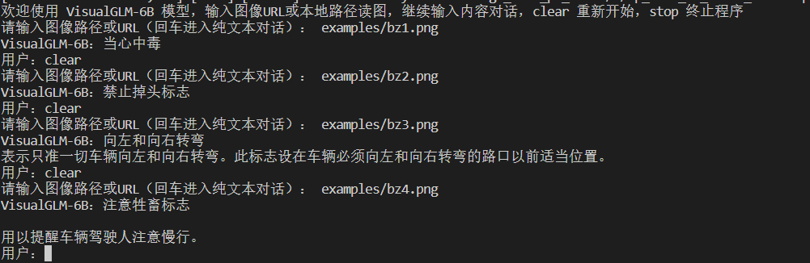

- 普通示例
```
python example_sat.py
```
```
import argparse
from finetune_visualglm import FineTuneVisualGLMModel
from transformers import AutoTokenizer
tokenizer = AutoTokenizer.from_pretrained("THUDM/chatglm-6b", trust_remote_code=True)
from model import chat, VisualGLMModel
#model, model_args = VisualGLMModel.from_pretrained('visualglm-6b', args=argparse.Namespace(fp16=True, skip_init=True))
from sat.model import AutoModel
model, model_args = AutoModel.from_pretrained(
        'merge_lora_p7_54000', # your-model-path
        args=argparse.Namespace(
        fp16=True,
        skip_init=True,
        use_gpu_initialization=True,
        device='cuda',
    ))
model = model.eval()

from sat.model.mixins import CachedAutoregressiveMixin
model.add_mixin('auto-regressive', CachedAutoregressiveMixin())
image_path = "examples/bz1.png"
response, history, cache_image = chat(image_path, model, tokenizer, "图中的标志表示什么含义？", history=[])
print(response) # 当心中毒

```

- Web Demo
我们提供了一个基于[Gradio](https://www.gradio.app/)的网页版Demo，首先安装 Gradio：pip install gradio。然后执行:
```
python web_demo.py
```
程序会运行一个Web Server，并输出地址。在浏览器中打开输出的地址即可使用。（通过修改model/infer_util.py中的模型路径加载不同模型）

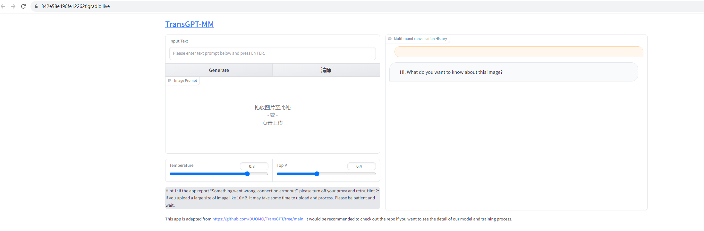

## 示例

- 交通标志
<p float="left">
    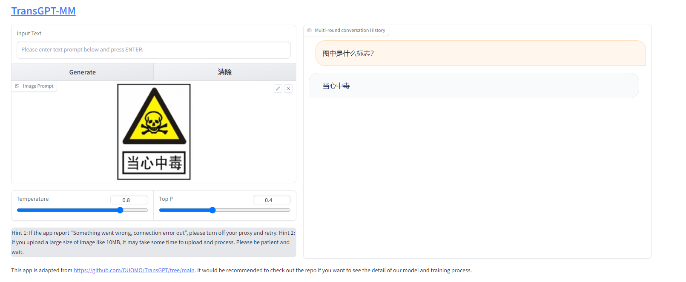
</p>
<p float="left">
    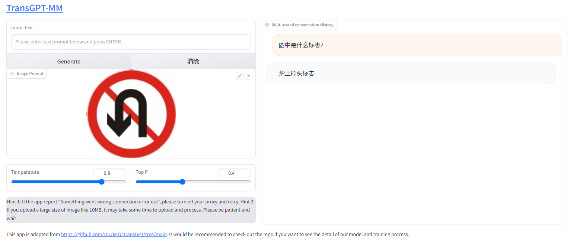
</p>
<p float="left">
    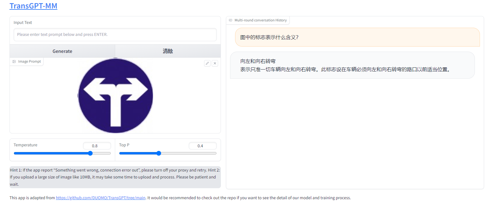
</p>
<p float="left">
    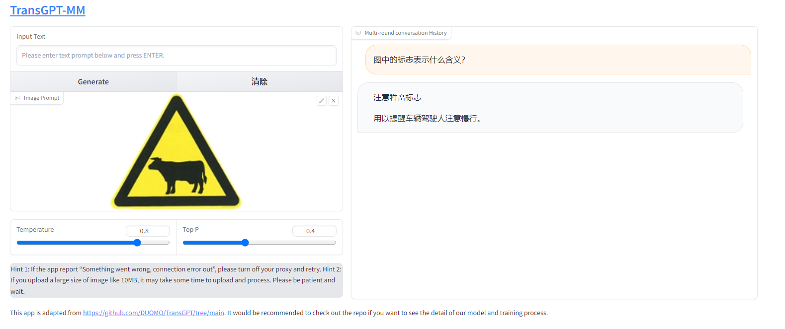
</p>

- 交通规则
<p float="left">
    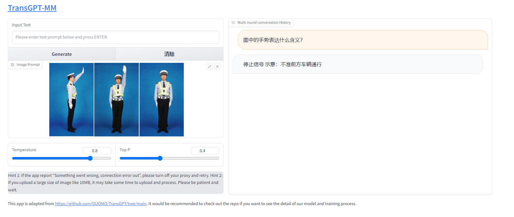
</p>
<p float="left">
    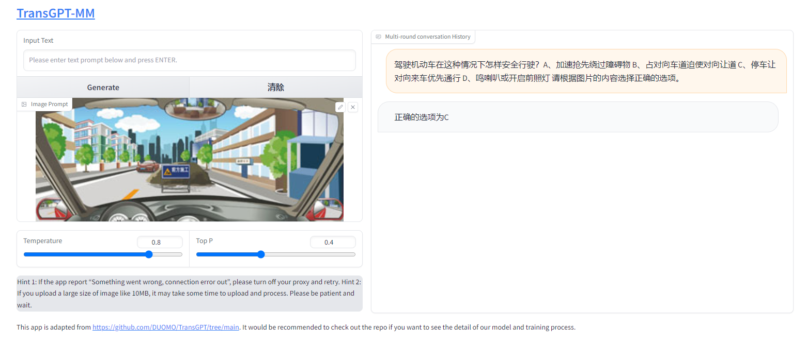
</p>
<p float="left">
    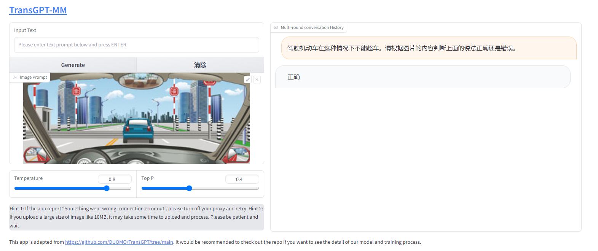
</p>
<p float="left">
    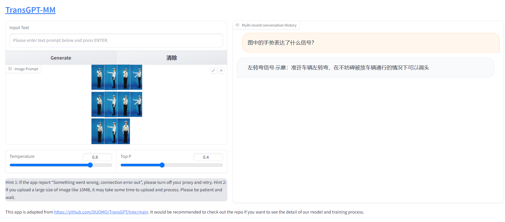
</p>

- 景点
<p float="left">
    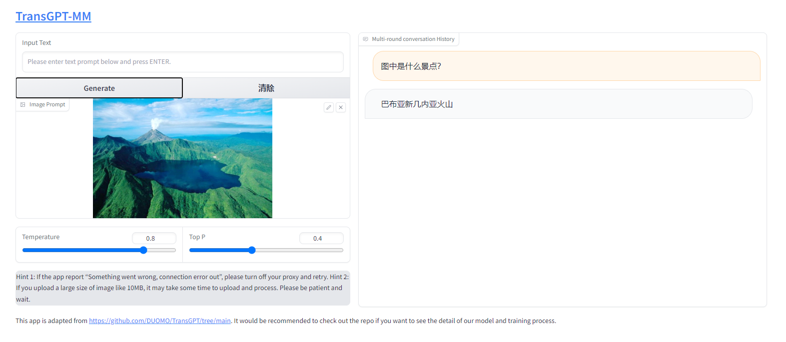
</p>
<p float="left">
    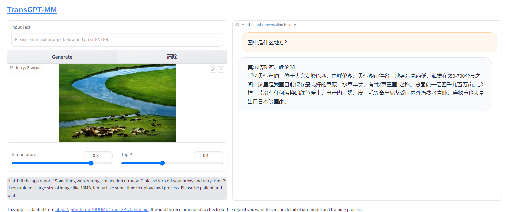
</p>
<p float="left">
    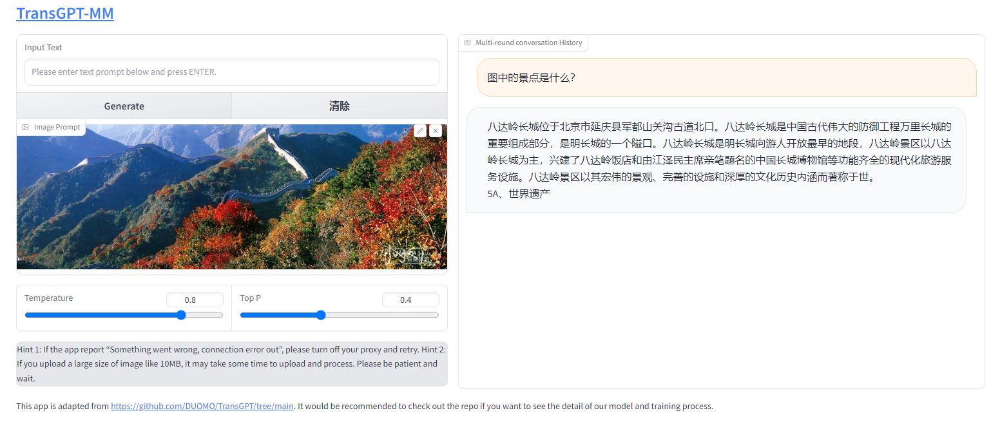
</p>
<p float="left">
    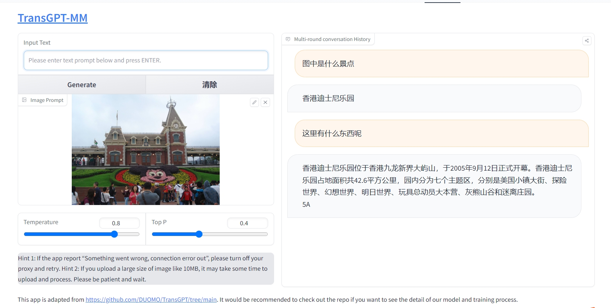
</p>

